# Table of content

- [Table of content](#table-of-content)
- [About](#about)
- [Data form](#data-form)
- [Api Features](#api-features)
    - [1. selecting fields](#1-selecting-fields)
    - [2. pagination](#2-pagination)
    - [3. sorting](#3-sorting)
    - [=> combine theme all](#-combine-theme-all)
- [Api Endpoints](#api-endpoints)
- [Choosing The Media Type](#choosing-the-media-type)
    - [method1 of choosing the media type:](#method1-of-choosing-the-media-type)
    - [method2 of choosing the media type:](#method2-of-choosing-the-media-type)
- [Handling Exceptions](#handling-exceptions)
    - [example1](#example1)
    - [example2:](#example2)
    - [example3](#example3)
    - [example4](#example4)
    - [example5](#example5)
    - [example6](#example6)
- [Use it locally](#use-it-locally)

# About

This is a RESTful api for the top 250 movies & top 25O tv shows of all time.\
The data is extracted from [IMDB.com](https://www.imdb.com/) using python and its librairies BeautifulSoup and requests.
The api is written in java using spring(boot/rest) framework.

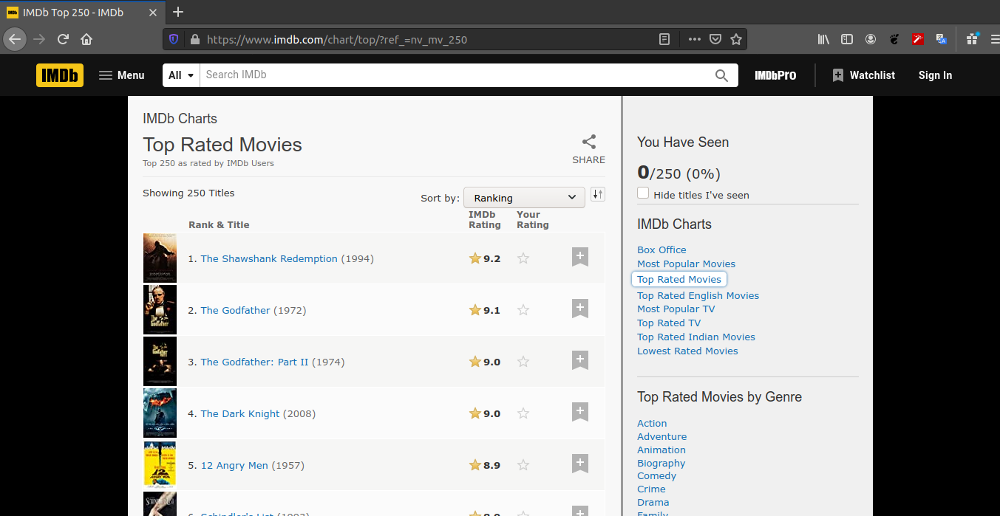

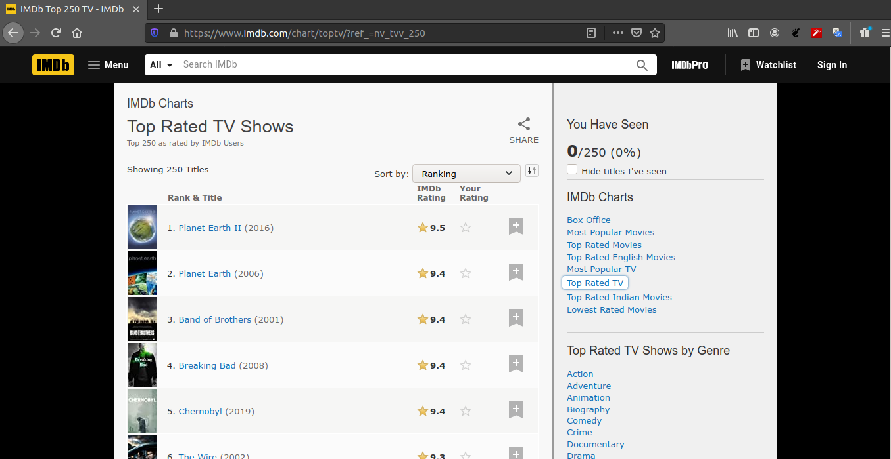

example of a GET request:
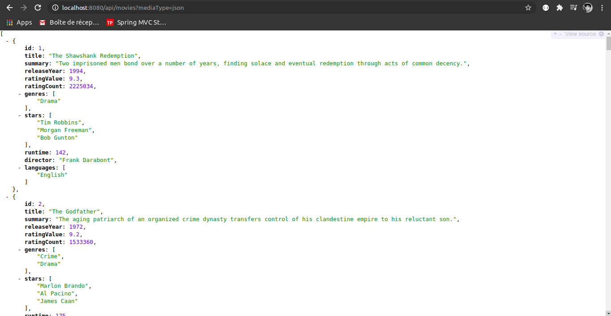


# Data form

extracted data form:

```
Movie:
    summary     :string
    releaseYear :int
    ratingValue :float
    ratingCount :int
    genres      :[string]
    stars       :[string]
    runtime     :float
    director    :string
    languages   :[string]
```

```
Tv Show:
    summary     :string
    releaseYear :int
    ratingValue :float
    ratingCount :int
    genres      :[string]
    stars       :[string]
    runtime     :float
    creator     :string
    languages   :[string]
    countries   :[string]
    episodes    :int
```

> you can find the data inside dev-data folder in the root of the project.


# Api Features

### 1. selecting fields

we can specify the fields to be returned from the server in the response using the _fields_ query param.

**syntaxe** : ?fields=field1,field2,field3...\
**example** : GET http://localhost:8080/api/movies?fields=title,summary,genres

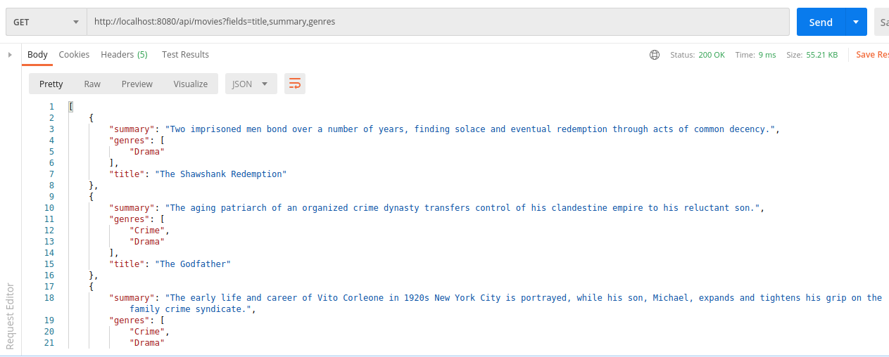

### 2. pagination

This api returns 250 result for both resources (250 movies & 250 tv shows).\
This is quit a lot to return, so we paginate the result to make sure the results are easier to handle.
we make use of 2 query params: page & limit.

<pre>
	page: page number
	limit: number of results per page	
</pre>

**syntaxe**: page=[page-number]&limit=[limit-value]\
**example**: GET http://localhost:8080/api/shows?page=2&limit=4&fields=id,title,ratingValue\_
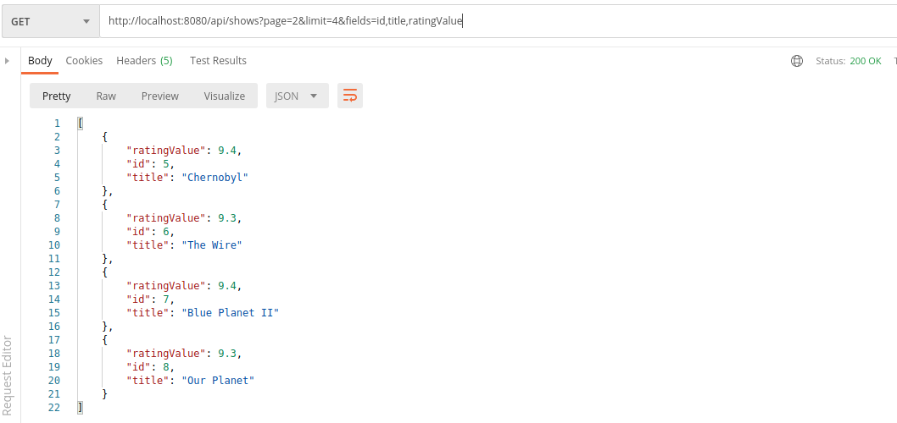

### 3. sorting

we can sort the returned results based on multiple fields(only desc).

**syntaxe**: ?sort=field1,field2\
**example**: _GET http://localhost:8080/api/movies?sort=releaseYear,ratingValue&fields=title,releaseYear,ratingValue_

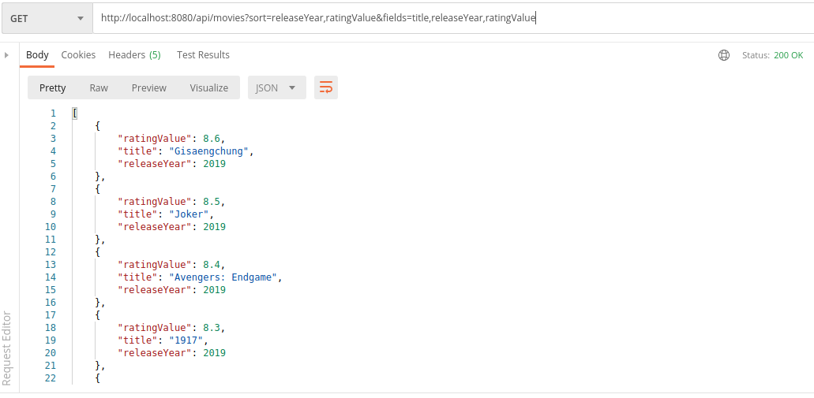

### => combine theme all

**example**: _GET http://localhost:8080/api/shows?sort=releaseYear,ratingValue,episodes&fields=title,releaseYear,ratingValue,episodes&page=3&limit=3_

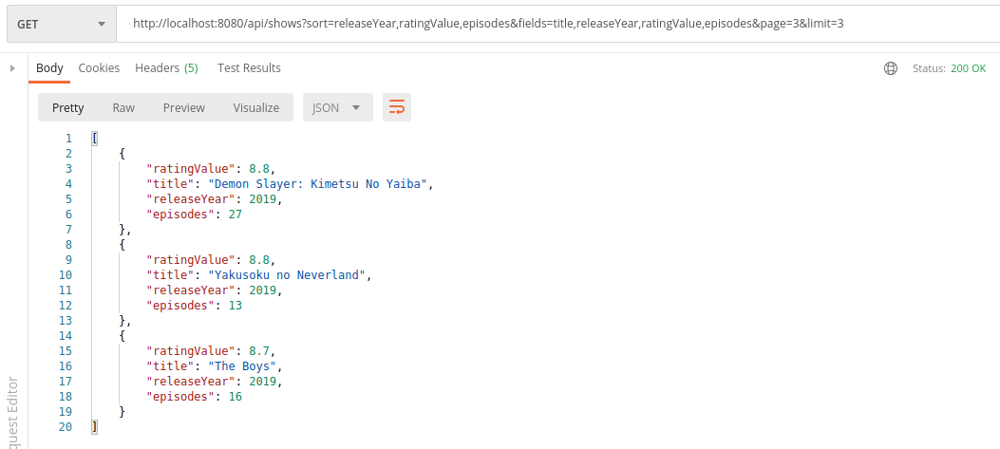


# Api Endpoints

```
GET     /api/movies
GET     /api/movies/:id
POST    /api/movies
PUT     /api/movies
PATCH   /api/movies
DELETE  /api/movies/:id
```

```
GET     /api/shows
GET     /api/shows/:id
POST    /api/shows
PUT     /api/shows
PATCH   /api/shows
DELETE  /api/shows/:id
```


# Choosing The Media Type

we can choose the media type(format) of the response. It can be JSON or XML.

### method1 of choosing the media type:

using a query param named mediaType (by default its json)\
**syntax**: _?mediaType=[xml|json]_\
**example**: _GET http://localhost:8080/api/movies?mediaType=xml_

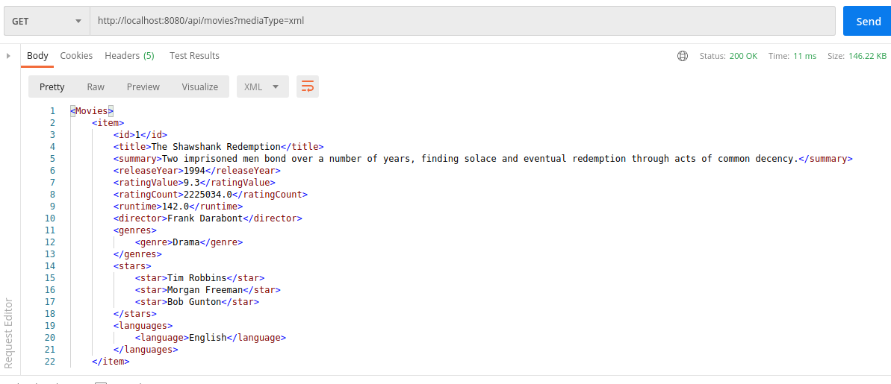

### method2 of choosing the media type:

setting the _accept_ param in the headers to be "application/json" or "application/xml"

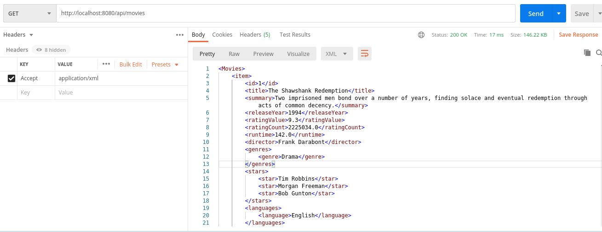


# Handling Exceptions

I handle many exceptions that may occur when a client is tying to consume the api.\
The response is a custom class named ResponseError that gets converted to JSON(or XML) when returned.

#### example1

| **exception**     | **cause**                                  |
| ----------------- | ------------------------------------------ |
| NotFoundException | request to a resource that does not exist. |

GET http://localhost:8080/api/movies/99999999 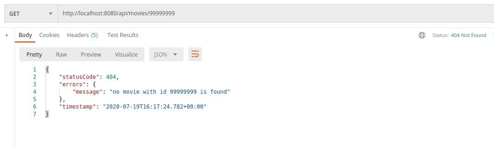

#### example2:

| **exception**                | **cause**                                |
| ---------------------------- | ---------------------------------------- |
| ConstraintViolationException | a constraint violation for request param |

for example, we set in the rest controller that the _**movieId**_ must be positive

```java
    public class MovieRestController{
        @GetMapping(path = "/{movieId}")
        public ResponseEntity<Movie> findById(@Positive @PathVariable int movieId) {
            if (movieId > 250) {
                throw new NotFoundException("no movie with id " + movieId + " is found");
            }
            return new ResponseEntity<>(movies[movieId - 1], HttpStatus.OK);

        }
    }
```

and the client is providing a negative one

GET http://localhost:8080/api/movies/-1
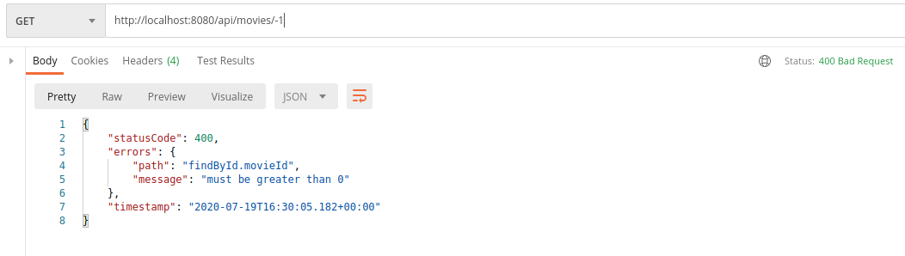

#### example3

| **exception**                          | **cause**                                      |
| -------------------------------------- | ---------------------------------------------- |
| HttpRequestMethodNotSupportedException | request to a not supported/allowed HTTP method |

COPY http://localhost:8080/api/movies 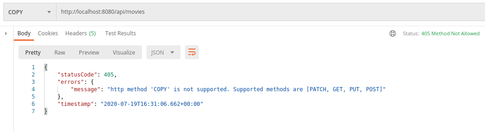

#### example4

| **exception**                       | **cause**                                                                                   |
| ----------------------------------- | ------------------------------------------------------------------------------------------- |
| MethodArgumentTypeMismatchException | request with a bad type for a request param (for ex _**movieId**_ is expected to be an int) |

GET http://localhost:8080/api/movies/not_an_int
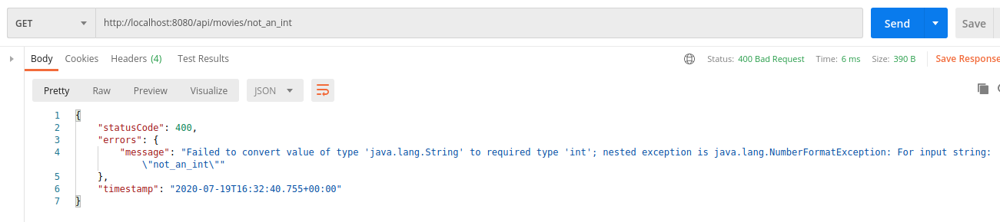

#### example5

| **exception**                   | **cause**                                                                                                    |
| ------------------------------- | ------------------------------------------------------------------------------------------------------------ |
| HttpMessageNotReadableException | bad value for a field, for ex the _title_ is expected to be a json string but the client is sending an array |

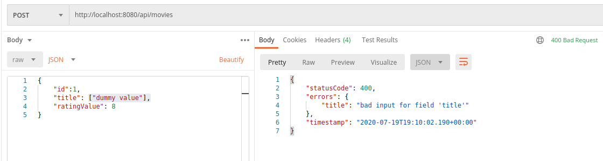

#### example6

| **exception**                   | **cause**                                                              |
| ------------------------------- | ---------------------------------------------------------------------- |
| MethodArgumentNotValidException | constraint violation for one of the fields in a POST/PUT/PATCH request |

Here is the java code for the Movie entity

```java
@Data
@NoArgsConstructor
@AllArgsConstructor
public class Movie{
    private Integer id;

    @NotBlank(message = "title must not be blank")
    private String title;

    @NotBlank(message = "summary must not be blank")
    private String summary;

    @Max(value = 2020, message = "invalid release Year")
    @Min(value = 1900, message = "invalid release Year")
    private Integer releaseYear;

    @Min(value = 0, message = "minimum rating value is 0")
    @Max(value = 10, message = "maximum rating value is 10")
    private Double ratingValue;

    @Min(value = 1, message = "minimum rating count is 1")
    private Double ratingCount;

    @JacksonXmlElementWrapper(localName = "genres")
    @JacksonXmlProperty(localName = "genre")
    private List<@NotBlank(message="genre must not be blank")String> genres;

    @JacksonXmlElementWrapper(localName = "stars")
    @JacksonXmlProperty(localName = "star")
    private List<@NotBlank(message="star name must not be blank") String> stars;

    @Min(value = 1, message = "minimum runtime of a movie is 1 mn")
    private Double runtime;

    private String director;

    @JacksonXmlElementWrapper(localName = "languages")
    @JacksonXmlProperty(localName = "language")
    private List<@NotBlank(message="language must not be blank") String> languages;

}
```

> I'm using hibernate validator to validate the beans before processing them.

and here is an example of the client not respecting the constraints.
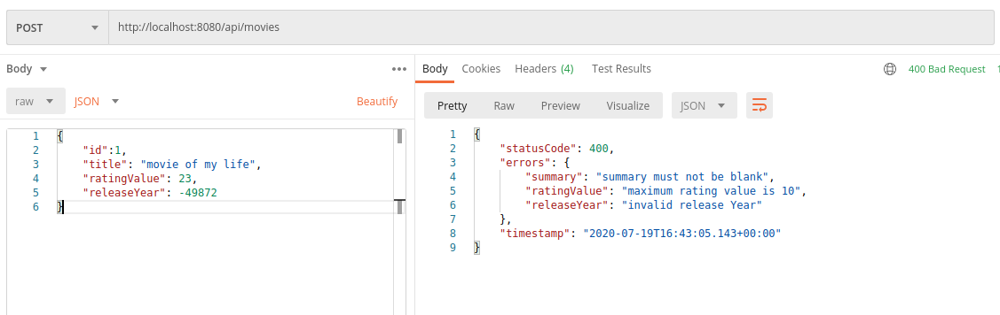


# Use it locally

* Make sure You have Java +11 installed (along with JAVA_HOME env varibale)
* Make sure you have Maven installed (along with MAVEN_HOME & M2_HOME env variables)
* Download the projet as a zip file 
* Unzip it
* Open the terminal & run 
 
    ```
    mvn spring-boot:run    
    ```
* Head to go to http://localhost:8080/api/movies?mediaType=json

